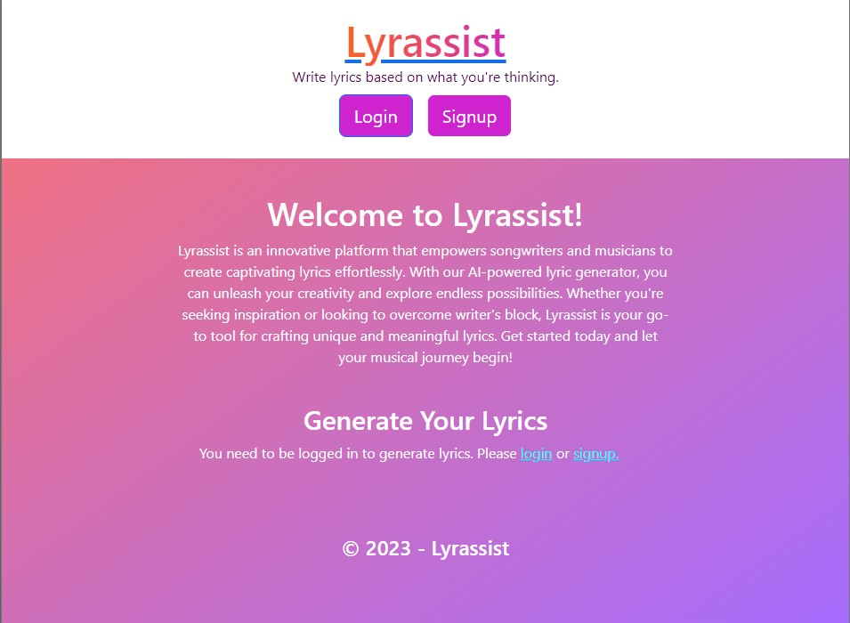
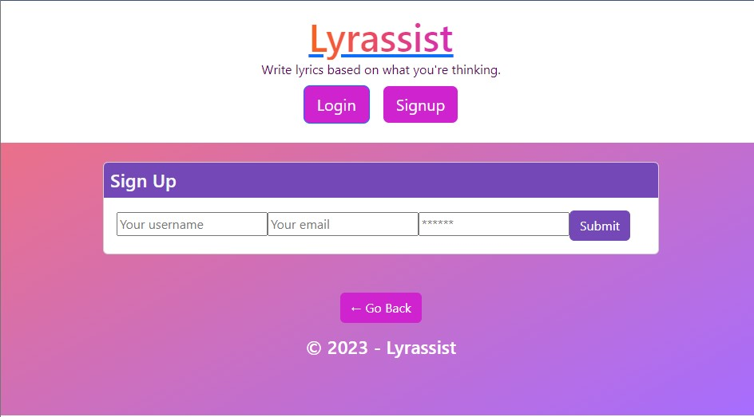
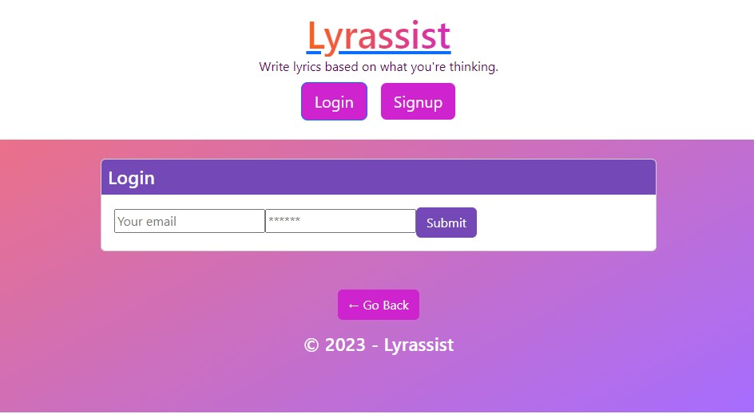
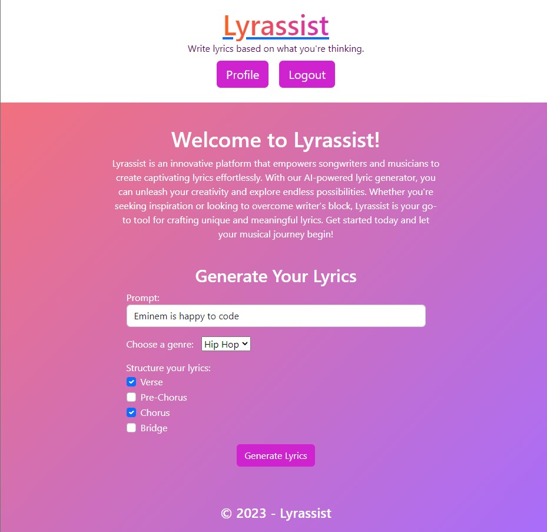
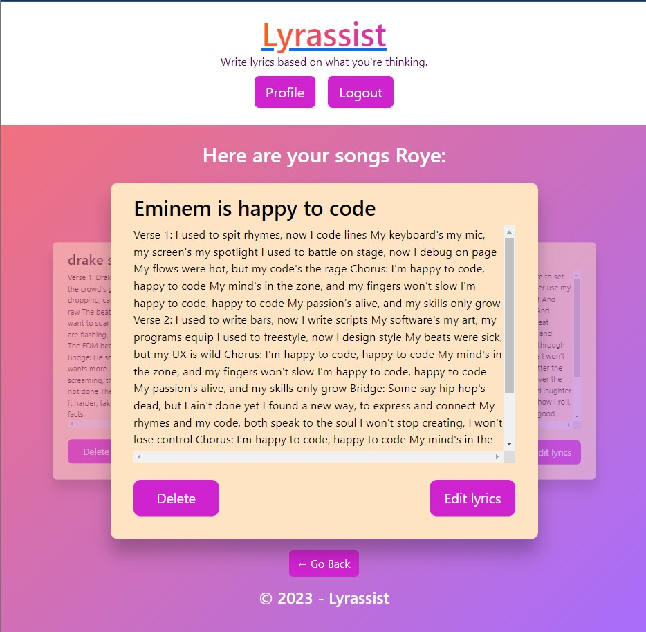

# Lyrassist

Lyrassist is a web application that leverages OpenAI GPT-3.5 to generate lyrics for various music genres. With the use of GraphQL and the MERN (MongoDB, Express.js, React, Node.js) stack, Lyrassist provides an intuitive and interactive platform for lyric generation. Whether you're a seasoned musician or a budding songwriter, Lyrassist is here to inspire you and elevate your musical creations to new heights.

## Table of Contents

- [Features](#features)
- [Technologies Used](#technologies-used)
- [Installation](#installation)
- [Usage](#usage)
- [Collaborators/Contributions](#collaboratorscontributions)
- [Deployment](#deployment)
- [License](#license)
- [Acknowledgements](#acknowledgements)

## Features

- Choose from a variety of music genres to generate lyrics.
- Get instant and creative lyric suggestions using OpenAI GPT-3.5.
- User authentication and profile management.
- Edit and delete generated lyrics through a carousel view.
- Responsive and user-friendly design.

## Technologies Used

- **Front-end:**
  - React: JavaScript library for building user interfaces.
  - Apollo Client: GraphQL client for React applications.
  - Bootstrap: CSS framework for responsive web design.
  - CSS3: Markup and styling of the application.

- **Back-end:**
  - Node.js: JavaScript runtime environment.
  - Express.js: Web application framework for Node.js.
  - GraphQL: Query language for APIs.
  - MongoDB: NoSQL database for storing user data and generated lyrics.
  - Mongoose: Object Data Modeling (ODM) library for MongoDB.

## Installation

1. Clone the repository: `git clone https://github.com/Rbustan0/lyrassist.git`
2. Install the dependencies:
   
   - At root directory: `npm install`
   
   OR

   - Front-end: `cd lyrassist/client` and run `npm install`
   - Back-end: `cd lyrassist/server` and run `npm install`

3. Set up environment variables:
   - Create a `.env` file in the `server` directory.
   - Define the required environment variables (e.g., database connection URI, JWT secret key).
4. Start the development server:
   - At root directory: run `npm run develop`
   OR
   - Front-end: `cd lyrassist/client` and run `npm start`
   - Back-end: `cd lyrassist/server` and run `npm start`

## Usage

1. Open your web browser and navigate to `http://localhost:3000`.
2. Sign up or log in to your account.
3. Choose a music genre and click the "Generate Lyrics" button.
4. View the generated lyrics on the carousel on your profile.
5. Click edit on the generated lyrics you want to edit and hit submit to save them as the new set of lyrics.

## Collaborators/Contributions

- Roye Bustan [Rbustan0](https://github.com/Rbustan0)
- Joseph Baek [jbaek97](https://github.com/jbaek97)
- Josh Dadbin [autohome](https://github.com/autohome)
- Shabab Chowdhury [shababrc](https://github.com/shababrc)

Contributions to Lyrassist are welcome! If you find any bugs, have suggestions for improvements, or would like to add new features, please submit an issue or a pull request to the repository.

## Deployment

 

[**Heroku Link**]()

 

**Images of Site Template**

  

    
  

  

    
  

  

    
  

  

    
  

  

    
  

  

    
  

## License

This project is licensed under the [MIT License](LICENSE). 

## Acknowledgements

- UCLA/EDX's instruction and sample documentation for web development
- Special thanks to the developers and contributors of the MERN stack and related libraries.
- Open AI Chat GPT API documentation